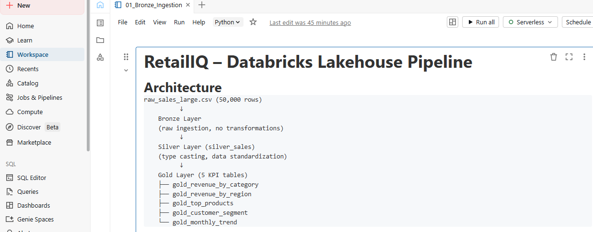
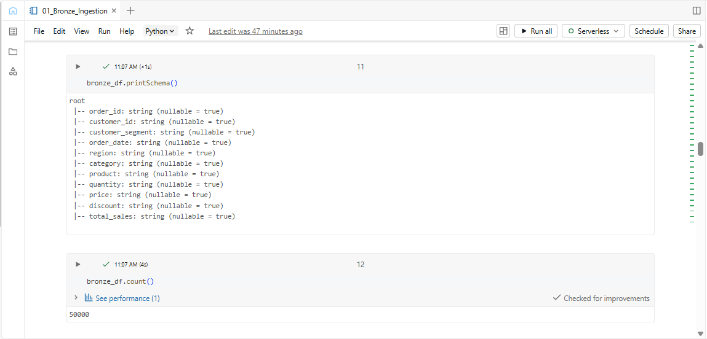
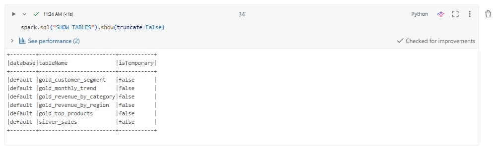
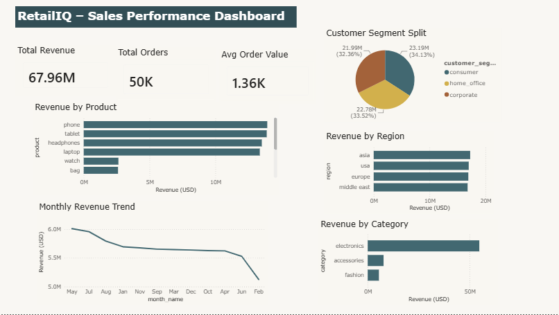

# RetailIQ – Retail IntelligencE System

## Overview
RetailIQ is an end-to-end retail analytics and data engineering platform built using Python, SQL, PySpark, Databricks, and Power BI.

It implements a modern Lakehouse architecture to transform raw retail data into structured, analytics-ready datasets for business decision-making.

## Problem Statement
Modern retail businesses face challenges such as:
- Fragmented sales, inventory, and customer data
- No unified system for tracking revenue, products, and customers
- Manual and slow reporting processes
- Difficulty identifying demand and revenue trends

RetailIQ solves this by building a centralized data platform with a SQL warehouse and interactive dashboards.

## Solution Architecture

```
Raw Data (CSV)
      ↓
Python Ingestion (data_loader.py)
      ↓
Bronze Layer (raw_sales_large.csv)
      ↓
Silver Layer (cleaned + transformed)
      ↓
Gold Layer (business KPIs)
      ↓
SQL Server Data Warehouse (Star Schema)
      ↓
Power BI Dashboard
```

## Tech Stack

| Layer | Technology |
|---|---|
| Data Ingestion | Python, Pandas |
| ETL Pipeline | Python (modular) |
| Data Storage | CSV Lakehouse (Bronze/Silver/Gold) |
| Data Warehouse | SQL Server (SSMS) |
| Data Modeling | Star Schema |
| Lakehouse Engine | Databricks, PySpark, Delta Lake |
| Visualization | Power BI |

## Project Structure

```
retail-intelligence-lakehouse/
│
├── data/
│   ├── bronze/         # Raw source data
│   ├── silver/         # Cleaned and transformed data
│   └── gold/           # Business KPI outputs
│
├── src/
│   ├── generate_data.py        # Synthetic retail dataset generator
│   ├── data_loader.py          # Extract layer
│   ├── data_transform.py       # Transform layer (Silver)
│   ├── data_gold.py            # Gold KPI layer
│   ├── logger.py               # Centralized logging
│   ├── load_dim_customer.py    # Dimension loader
│   ├── load_dim_product.py     # Dimension loader
│   ├── load_dim_region.py      # Dimension loader
│   ├── load_dim_date.py        # Dimension loader
│   └── load_fact_table.py      # Fact table loader
│
├── notebooks/
│   └── retailiq_lakehouse.py   # Databricks PySpark notebook
│
├── sql/
│   ├── schema/                 # Table definitions (DDL)
│   └── analytics.sql           # Business analytics queries
│
├── dashboard/
│   ├── RetailIQ_Dashboard.pbix # Power BI working file
│   └── RetailIQ_Dashboard.png  # Dashboard screenshot
│
└── docs/
    ├── databricks_architecture.png
    ├── databricks_bronze.png
    └── databricks_tables.png
```

## Dataset

- 50,000 synthetic retail transactions
- Date range: 2023 – 2025
- Products: 11 (electronics, fashion, accessories)
- Regions: Asia, Europe, USA, Middle East
- Customer segments: Consumer, Corporate, Home Office

## Data Warehouse – Star Schema

```
         dim_customer
               |
dim_product──fact_sales──dim_region
               |
            dim_date
```

| Table | Rows |
|---|---|
| dim_customer | 8,960 |
| dim_product | 11 |
| dim_region | 4 |
| dim_date | 1,096 |
| fact_sales | 50,000 |

## Business Analytics Queries

Five analytical SQL queries built on the star schema:

1. Total revenue by region
2. Total revenue by product and category
3. Revenue by customer segment
4. Monthly revenue trend
5. Top products by revenue per region

## Key Results

| Region | Total Revenue |
|---|---|
| Asia | $17,254,330 |
| USA | $16,993,880 |
| Europe | $16,921,682 |
| Middle East | $16,793,326 |

| Product | Total Revenue |
|---|---|
| Phone | $13,932,790 |
| Tablet | $13,893,276 |
| Headphones | $13,517,700 |

## Databricks Lakehouse Implementation

The pipeline is also implemented natively in Databricks using PySpark and Delta Lake.

### Databricks Architecture
```
raw_sales_large.csv (50,000 rows)
          ↓
    Bronze Layer
    (raw ingestion via Spark)
          ↓
    Silver Layer (silver_sales)
    (type casting, standardization)
          ↓
    Gold Layer (5 Delta tables)
    ├── gold_revenue_by_category
    ├── gold_revenue_by_region
    ├── gold_top_products
    ├── gold_customer_segment
    └── gold_monthly_trend
```

### Databricks Screenshots

**Architecture and Pipeline**


**Bronze Ingestion**


**Delta Tables**


## Dashboard Preview



## Status

| Component | Status |
|---|---|
| ETL Pipeline | ✅ Complete |
| Bronze / Silver / Gold Layers | ✅ Complete |
| SQL Server Data Warehouse | ✅ Complete |
| Star Schema | ✅ Complete |
| Analytics SQL Queries | ✅ Complete |
| Databricks PySpark Pipeline | ✅ Complete |
| Delta Lake Tables | ✅ Complete |
| Power BI Dashboard | ✅ Complete |